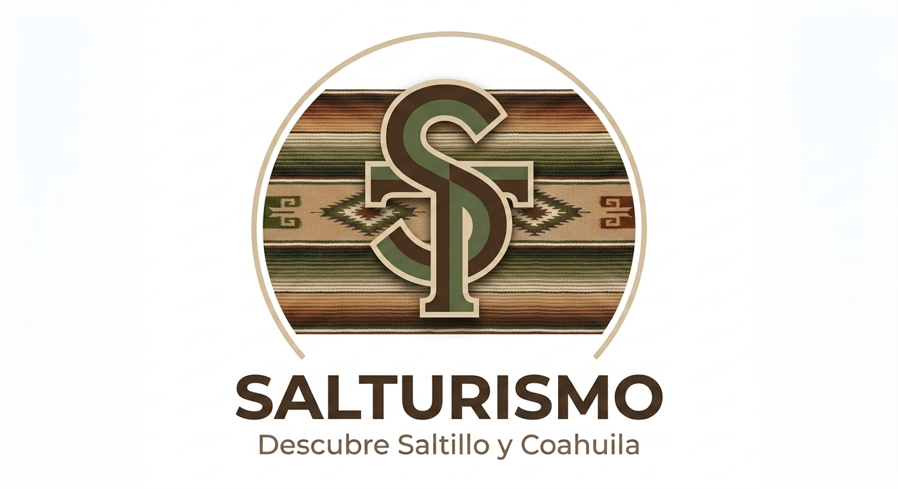

<p align="center">
  
</p>

<h1 align="center">🌮 SalTurismo</h1>

<p align="center">
  <strong>¡A dónde vamos!?</strong> — Plataforma de turismo y eventos culturales de Saltillo, Coahuila.
</p>

<p align="center">
  <a href="https://salturi.vercel.app/html/index.html"></a>
  
  
</p>

---

## 🔗 Demo en Producción

**👉 [https://salturi.vercel.app/html/index.html](https://salturi.vercel.app/html/index.html)**

---

## 📋 Descripción

**SalTurismo** es una plataforma web completa que conecta a turistas y locales con la oferta cultural, gastronómica y recreativa de Saltillo, México. Integra un mapa interactivo con +30 puntos de interés, un sistema de eventos moderados por IA, autenticación segura con Google OAuth, clima en tiempo real y un panel de administración.

---

## 🏗️ Arquitectura en la Nube

```
┌─────────────────┐      ┌──────────────────┐      ┌─────────────────┐
│   Frontend      │      │    Backend API   │      │   Base de Datos │
│   (Vercel)      │◄────►│    (Render)      │◄────►│   (Supabase)    │
│   HTML/CSS/JS   │      │   Python/Flask   │      │   PostgreSQL    │
└─────────────────┘      └──────────────────┘      └─────────────────┘
                                  │
                          ┌───────┴───────┐
                          │               │
                   ┌──────▼──────┐ ┌──────▼──────┐
                   │  Gemini AI  │ │ Cloudinary  │
                   │ Moderación  │ │  Imágenes   │
                   └─────────────┘ └─────────────┘
```

---

## 🛠️ Stack Tecnológico

| Capa | Tecnología | Despliegue |
|------|-----------|------------|
| **Frontend** | HTML5, CSS3, JavaScript ES6+ | [Vercel](https://vercel.com) |
| **Backend** | Python 3.12, Flask, Gunicorn | [Render](https://render.com) |
| **Base de Datos** | PostgreSQL (Supabase) | Supabase Cloud |
| **Autenticación** | Supabase Auth (Email + Google OAuth) | Supabase Cloud |
| **Moderación IA** | Google Gemini 1.5 Flash (API REST) | Google AI |
| **Multimedia** | Cloudinary (webp auto, resize, quality auto) | Cloudinary Cloud |
| **Mapas** | Leaflet.js + OpenStreetMap | CDN |
| **Clima** | Open-Meteo API (sin key) | Open-Meteo |

---

## ✨ Funcionalidades Clave

### 🔐 Autenticación Segura
- Registro con validación de contraseña fuerte (8+ caracteres, mayúscula obligatoria)
- Inicio de sesión con Email/Password
- Inicio de sesión con Google OAuth (un clic)
- Sesión persistente con token JWT

### 🎪 Eventos Culturales Dinámicos
- Publicación de eventos con formulario completo
- Moderación automática con IA (Gemini) antes de publicar
- Carrusel interactivo con filtros por categoría (Cultura, Gastronomía, Naturaleza, Música, Deportes, Historia)
- Modal de detalle con descripción, fecha, ubicación y categoría
- Filtrado automático de eventos pasados

### 🗺️ Mapa Interactivo
- +33 puntos de interés distribuidos Norte/Centro/Sur de Saltillo
- Marcadores con íconos por categoría y colores distintivos
- Filtros interactivos con zoom dinámico
- Puntos de emergencia (hospitales, Cruz Roja, bomberos)
- Geolocalización en tiempo real del usuario
- Popups con descripción y enlace a Google Maps

### 🌤️ Clima en Tiempo Real
- Temperatura actual con ícono y descripción
- Sensación térmica y velocidad del viento
- Pronóstico de 3 días
- Recomendaciones turísticas dinámicas según el clima

### 🖼️ Gestión de Imágenes (Cloudinary)
- Subida automática al crear eventos
- Transformaciones on-the-fly: formato WebP, resize 1000px, calidad automática
- Fallback graceful si Cloudinary no está configurado

### 🛡️ Panel de Administración
- Acceso protegido por rol (solo admins)
- Tabla de eventos pendientes con aprobación/rechazo en 1 clic
- Métricas: eventos moderados (24h/semana), aprobados, pendientes
- Gestión de usuarios con opción de bloqueo

### 🌐 Bilingüe (ES/EN)
- Cambio dinámico sin recargar página
- Preferencia guardada en localStorage
- Nombres propios de lugares nunca se traducen

### ⭐ Favoritos
- Panel lateral con tarjetas de lugares guardados
- Clic para centrar mapa en la ubicación
- Persistencia en localStorage + Supabase (si hay sesión)

---

## 🚀 Ejecución Local

### Prerrequisitos
- Python 3.10+
- Navegador moderno
- Cuenta en [Supabase](https://supabase.com)
- API Key de [Google AI Studio](https://aistudio.google.com/apikey) (opcional)
- Cuenta en [Cloudinary](https://cloudinary.com) (opcional)

### 1. Clonar y configurar backend
```bash
git clone https://github.com/yukiidkk/Salturi.git
cd Salturi/backend
python -m venv venv
venv\Scripts\activate          # Windows
pip install -r requirements.txt
```

### 2. Variables de entorno (`backend/.env`)
```env
SUPABASE_URL=https://tu-proyecto.supabase.co
SUPABASE_KEY=tu_anon_key
FLASK_ENV=development
GEMINI_API_KEY=tu_gemini_key
CLOUDINARY_CLOUD_NAME=tu_cloud
CLOUDINARY_API_KEY=tu_key
CLOUDINARY_API_SECRET=tu_secret
```

### 3. Iniciar backend
```bash
python app.py
# → http://localhost:5000/api/v1/health
```

### 4. Iniciar frontend
```bash
# Usar Live Server (VS Code) apuntando a frontend/html/index.html
# → http://127.0.0.1:5500/frontend/html/index.html
```

---

## 📁 Estructura del Proyecto

```
SalTurismo/
├── frontend/
│   ├── html/          # Vistas (index, login, register, create-event, admin)
│   ├── css/           # Estilos globales
│   ├── js/            # Scripts modulares (main, map, auth, i18n, config, admin, create-event)
│   └── images/        # Assets estáticos
├── backend/
│   ├── app.py         # Punto de entrada Flask
│   ├── config.py      # Variables de entorno
│   ├── Procfile       # Despliegue Render
│   ├── routes/        # Endpoints API (events, places, reviews, admin, moderate)
│   ├── services/      # Supabase, Gemini, Cloudinary
│   └── migrations/    # SQL para Supabase
├── README.md
└── .gitignore
```

---

## 🔑 API Endpoints

| Método | Ruta | Descripción |
|--------|------|-------------|
| `GET` | `/api/v1/health` | Health check |
| `GET` | `/api/v1/events` | Listar eventos aprobados |
| `POST` | `/api/v1/events` | Crear evento (con Cloudinary) |
| `GET` | `/api/v1/places` | Listar lugares turísticos |
| `POST` | `/api/v1/reviews` | Crear reseña |
| `POST` | `/api/v1/moderate` | Moderar contenido con Gemini IA |
| `PATCH` | `/api/v1/admin/events/:id/status` | Aprobar/rechazar evento |

---

## 👥 Equipo

Proyecto desarrollado para la comunidad de **Saltillo, Coahuila, México**.

---

<p align="center">
  <strong>SalTurismo</strong> — ¡A dónde vamos!? 🌮🗺️<br>
  <sub>© 2025 SalTurismo. Todos los derechos reservados.</sub>
</p>
